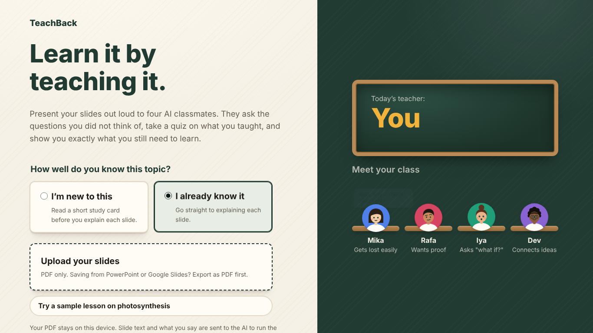
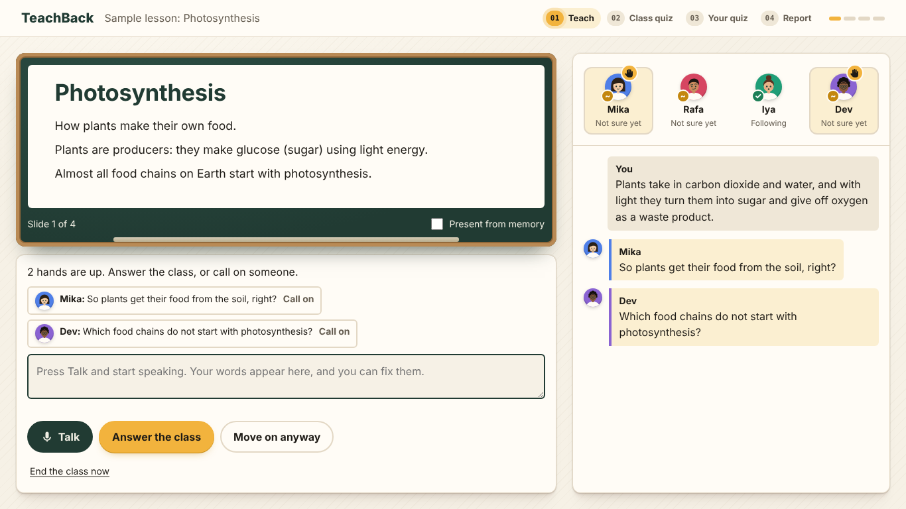
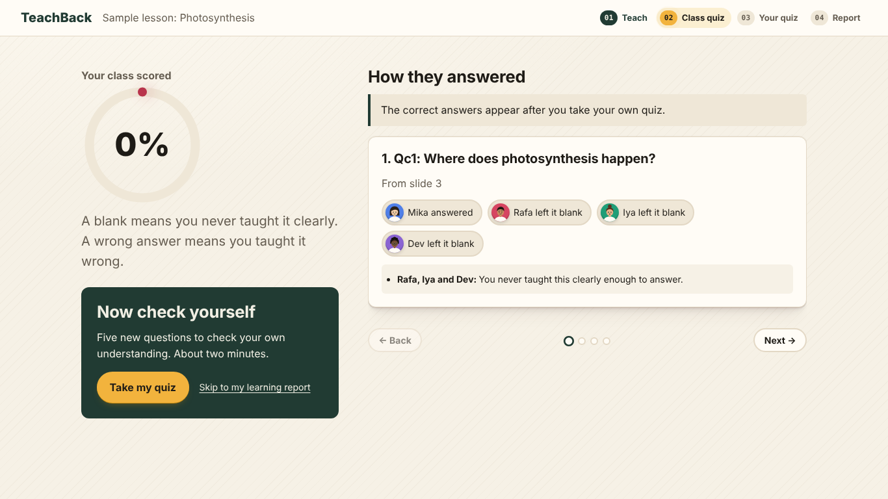
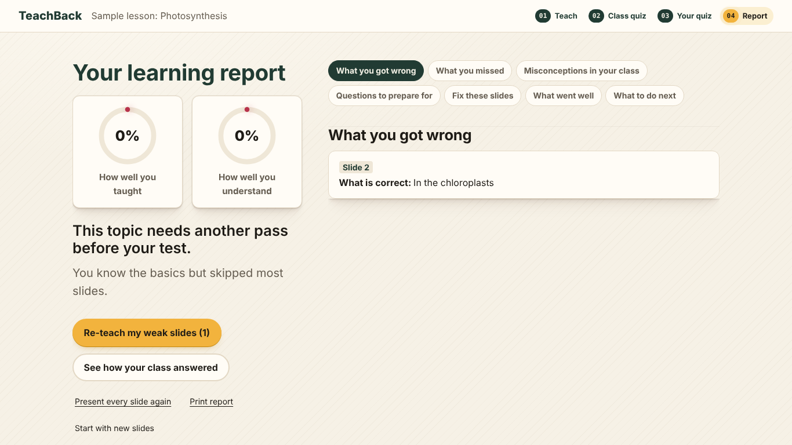

# TeachBack

**Learn it by teaching it.** Upload your slides, present them out loud to four AI classmates, and find out what you really understand.

Built for the CSC Back-to-School Hackathon (2026).

| Start | Teaching | Class quiz | Learning report |
| --- | --- | --- | --- |
|  |  |  |  |

**In one line:** you can only pass the quiz if you really taught the idea, so teaching it makes you learn it.

## The problem

Students present reports, recite and defend research all the time, and the best way to learn something is to teach it. But practicing alone gives no feedback: nobody asks the question you did not think of, and you never find out which parts you explained badly until the real presentation or the test.

## What it does

1. **Upload your slides** (PDF). The text on each slide becomes the "answer key".
2. **Present each slide out loud** to a class of four AI classmates. Your voice is turned into text. Turn on **Present from memory** to hide the slide while you explain (you can still peek): explaining without notes is one of the best ways to really learn something.
   - **New to the topic? Choose "I'm new to this"** on the start screen (or press "Study this slide first" on any slide). You get a short study card written only from your slides: what it means, an example, why it works, a common mistake, and what your slides don't explain. Then the slide and card hide and you explain it from memory. Copying the card out counts as reading, not teaching.
3. **The class reacts like a real class.** Hands go up, and each classmate shows a mood (confused, not sure, following):
   - **Mika** gets lost easily and catches skipped steps.
   - **Rafa** wants proof for every claim.
   - **Iya** asks "what if?" with edge cases.
   - **Dev** connects the topic to other ideas.
   - A classmate may arrive believing a **common misconception** (like "plants get their food from the soil"). They keep believing it until you correct it (on that slide or any later one). If you never do, they get that quiz question wrong, and the idea comes back when you re-teach that slide.
   - If you just **read the slide out loud** (or paste slide text, from any slide), they notice and ask what it actually means. A strong reader may understand from the slide alone, shown as **"From the slide"**. Quiz answers that only come from slide text you read out never count as your teaching, and neither does a quote that is mostly copied slide text. Saying the slide's words from memory (with the slide hidden) does count: that is recall, not reading.
   - Don't need a slide (title, agenda, "thank you")? **Skip it.** Short on time? **End the class early.** The quiz and report only cover the slides you presented.
4. **Answer the whole room, or click a raised hand to call on someone.** Classmates remember everything you told anyone. Satisfied students lower their hands; confused ones follow up. They never hand you the answer: when you are wrong, they push back so you have to rethink it.
5. **Your classmates take a quiz using only your own words.** Every answer must quote something you actually said, and the server checks the quote is real. If you never taught it, they leave it blank. If you taught it wrong, they get it wrong.
6. **You take your own quiz** to check your own understanding. For each question you miss, you first write one sentence on why the right answer is right, and only then see the explanation. Questions you miss also mark their slides for re-teaching. Until you take (or skip) it, the class results only show who answered and who left it blank, so nothing gives away the answers.
7. **Learning report:** what you got wrong (quoting your exact words), what you missed, misconceptions you corrected or missed, "why" questions you could not explain yet, slides you read instead of explaining, questions to prepare for, slides to fix, and what to do next.
8. **Re-teach your weak slides** (after you have seen the answers and your report). TeachBack picks the slides your class struggled with, reminds you what they missed, and lets you explain just those again. The class takes a **new** quiz (mostly on the re-taught slides, never repeating old questions), and you see your score on those same slides before and after. New questions mean a higher score shows you taught it better, not that you remembered the answers.

## How it works

```
Browser (public/)                           Server (lib/tasks.js)            Featherless (GLM, DeepSeek...)
                                                                             Gemini (voice only)
- reads the PDF with pdf.js                 - builds the prompts             - generates questions,
- turns speech into text (Web Speech API)   - holds the API key                quizzes and reports
- shows the classroom, quizzes, report  ->  - checks and cleans AI answers -> 
```

- **The key idea: every point must be taught by you.** The quiz is written from your slides, but your classmates only get your own words (never their own questions, which could contain hints) and never see the answer key. Then three checks keep the score honest:
  1. A stronger model checks the quiz itself against your slides and fixes wrong answer keys (`checkQuiz`).
  2. Each classmate answer must quote you, and the server confirms the quote really appears in what you said (`quoteIsReal`).
  3. A stronger model confirms the quote actually teaches the picked answer, not just that it is real (`verifyAnswers`).
  The report's "You said" lines are checked against your words too, so it never puts words in your mouth.
- **One AI request per class turn** for the whole class, which keeps the app fast and within plan limits.
- **One request at a time, most urgent first.** The plan runs one big-model request at a time, so the browser and the server both send one at a time. Background work (writing your own quiz while you read the results) is paused when you ask for something, like the report, and continues afterwards. A request the browser gives up on is stopped on the server too.
- **Long presentations fit.** The plan allows 32K tokens per request, so the current slide and recent discussion are sent in full and older slides are shortened. A 30-slide talk stays around 10 to 15K tokens.
- **Featherless runs all the text work, with the right model for each job.** The live class uses a fast model (DeepSeek-V4.1-Flash) so classmates reply in seconds. Quizzes are written by the fast model too (so they are ready quickly), then a bigger, more accurate model (GLM-5.3) checks every question and answer key and writes the learning report, and Kimi-K3 grades the class quiz and verifies the quotes. If a model is slow or busy, the next one on your plan takes over. Gemini only turns voice into text in browsers without live speech.
- **The API key never reaches the browser.** The browser only sends a task name (`classTurn`, `quiz`, `exam`, `report`, `transcribe`) and the data. All prompts live in `lib/tasks.js`.
- **Nothing is saved.** The PDF stays on your device. Only slide text and what you say are sent to the AI for the current session.

### Files

| File | What it does |
| --- | --- |
| `public/index.html` | The page |
| `public/js/app.js` | Screens and the class flow |
| `public/js/pdf.js` | Reads slides and their text from the PDF |
| `public/js/speech.js` | Live voice-to-text (Chrome, Edge) |
| `public/js/recorder.js` | Phrase-by-phrase voice for other browsers, with a mic level meter |
| `public/js/api.js` | Sends tasks to the server |
| `lib/tasks.js` | The AI prompts, Gemini calls and the backup logic |
| `lib/featherless.js` | Featherless calls and automatic model choice |
| `server.js` | Local server (`npm start`) |

## Run it on your computer

You need **Node.js 18 or newer** (download the LTS version from nodejs.org). No other installs are needed.

1. Get your keys:
   - **Featherless** (main AI): create an API key in your [Featherless](https://featherless.ai) account.
   - **Gemini** (voice in Brave/Firefox): free key at [aistudio.google.com](https://aistudio.google.com) ("Get API key").
2. Copy `.env.example` to `.env` and paste the keys after `FEATHERLESS_API_KEY=` and `GEMINI_API_KEY=`.
3. In the project folder, run:
   ```
   npm start
   ```
4. Open **http://localhost:3000** and allow the microphone when asked.
   - **Chrome and Edge:** your words appear live as you talk.
   - **Brave, Firefox and others:** a live meter shows the mic is hearing you, and each phrase is written out by Gemini (Flash-Lite) a moment after you pause.

No PDF handy? Press **Try a sample lesson on photosynthesis**.

## Tips

- Only your own computer can open the app (so nobody else on your Wi-Fi can use your AI credits). To try it on your phone, set `HOST=0.0.0.0` in `.env`, restart, and open `http://<your computer's IP>:3000`.
- PowerPoint or Google Slides: export as PDF first.
- Slides that are only pictures have no text to check against. Add the key points as text.
- The server window shows which AI and model are in use, and when the backup takes over.
- TeachBack picks models automatically. To force one, set `FEATHERLESS_MODEL` or `GEMINI_MODEL` in `.env`.

## What's next

- **Panel mode:** present to a panel of AI experts or examiners instead of classmates, for rehearsing a real presentation, a thesis defense or a pitch. They press on weak points and give feedback.
- **Saved progress** across sessions, so you can see a topic improve over time.
- **Teachers' view:** share one class set of slides and see which ideas the whole class finds hard.

## Credits

- [pdf.js](https://github.com/mozilla/pdf.js) by Mozilla (Apache-2.0), bundled in `public/vendor/pdfjs/`.
- [Featherless.ai](https://featherless.ai) (hackathon sponsor) for the AI classmates, quizzes and reports.
- [Google Gemini API](https://ai.google.dev) for voice transcription in some browsers.
- Web Speech API built into Chrome and Edge for live voice input; Gemini transcribes recordings in other browsers.
- Fonts: Bricolage Grotesque and Atkinson Hyperlegible from Google Fonts.

## AI use disclosure

- **In the product:** open models on Featherless play the four classmates, write the quizzes, take the class quiz from your words and write the learning report. Gemini also transcribes voice in some browsers.
- **While building:** we used Claude (Anthropic) to brainstorm the idea and help write and debug the code. We reviewed, tested and can explain every part of the project.
